# Serverless AWS Data Pipeline 🚀

This project is a fully automated ETL pipeline deployed on AWS using Terraform.

## 🏗 Architecture

1. **Source:** Fetches data from external API (DummyJSON).
2. **Compute:** AWS Lambda (Python 3.10) for extraction, validation, and transformation.
3. **Storage:** AWS S3 (Raw, Quarantine, Processed zones).
4. **IaC:** Terraform for full infrastructure deployment.
5. **Validation:** Pydantic for data quality checks.

## 🏗 Data Pipeline Architecture

```mermaid
graph LR
    %% Styles
    style EB fill:#FF9900,stroke:#333,stroke-width:2px,color:white
    style API fill:#E1E1E1,stroke:#333,stroke-width:2px
    style LAM fill:#FF9900,stroke:#333,stroke-width:2px,color:white
    style S3 fill:#3F8624,stroke:#333,stroke-width:2px,color:white
    style RAW fill:#f9f9f9,stroke:#333,stroke-dasharray: 5 5
    style PRO fill:#f9f9f9,stroke:#333,stroke-dasharray: 5 5
    style QUA fill:#ffcccc,stroke:#333,stroke-dasharray: 5 5

    %% Nodes
    EB(⏱️ EventBridge Scheduler<br/>Daily 9:00 AM)
    API(☁️ External API<br/>DummyJSON)
    
    subgraph AWS_Cloud [AWS Cloud Environment]
        direction LR
        LAM(λ AWS Lambda<br/>Python 3.10 ETL)
        
        subgraph S3_Bucket [S3 Data Lake]
            RAW[📂 Raw Zone<br/>.json]
            PRO[📂 Processed Zone<br/>.csv]
            QUA[📂 Quarantine Zone<br/>Error Logs]
        end
    end

    %% Flow Connections
    EB -- Triggers --> LAM
    LAM -- 1. Extract Data --> API
    API -- Return JSON --> LAM
    LAM -- 2. Save Original --> RAW
    LAM -- 3. Validate & Transform --> PRO
    LAM -- If Error --> QUA

    %% Link Styling
    linkStyle 0 stroke:#FF9900,stroke-width:2px;
    linkStyle 4 stroke:green,stroke-width:2px;
    linkStyle 5 stroke:red,stroke-width:2px;
```

## 🛠 Tech Stack

- **Language:** Python (Pandas, Requests, Pydantic)
- **Cloud:** AWS (Lambda, S3, IAM, CloudWatch)
- **Infrastructure as Code:** Terraform
- **Deployment:** GitHub Actions / Terraform CLI

## 🚀 How to Deploy

1. Clone the repo.
2. `cd infra`
3. `terraform init`
4. `terraform apply`
